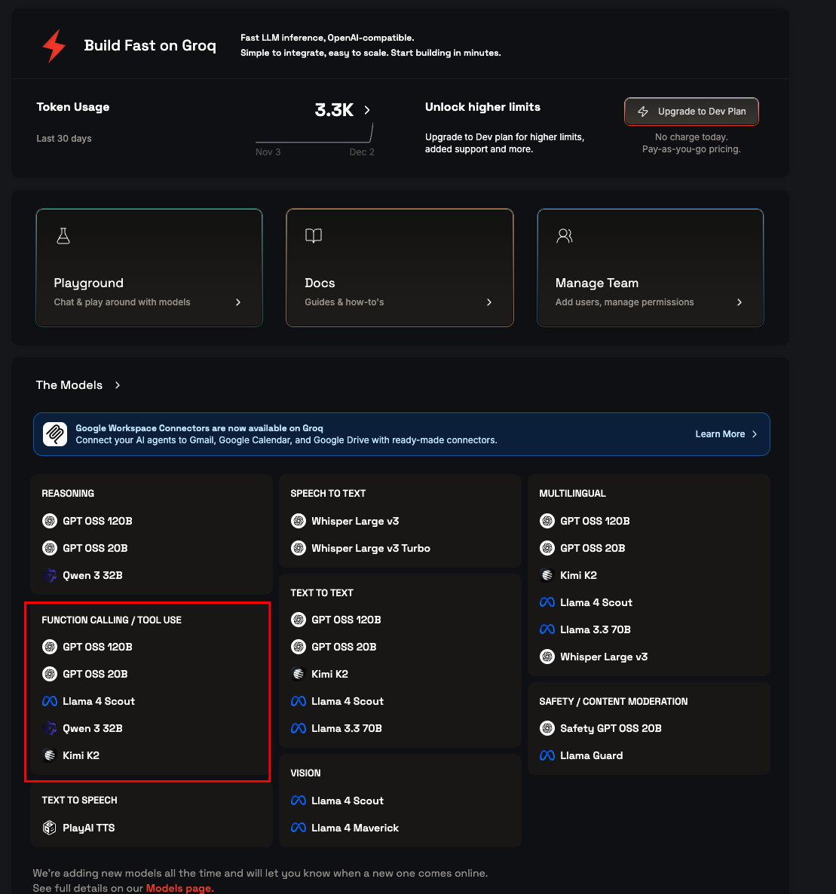
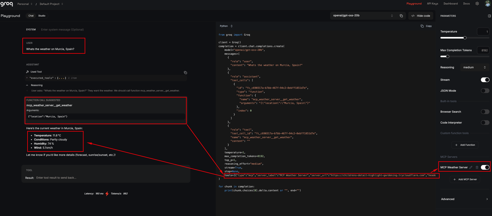

## Fill the Form:

**Server Name***:
```
MCP Weather Server
```
(Or any name you prefer)

**Server URL***:
```
https://childrens-detail-highlight-gardening.trycloudflare.com
```
✅ **Use the base URL only** (no `/mcp` needed)

Groq will automatically call:
- `/initialize` - to initialize the MCP connection
- `/tools/list` - to discover available tools  
- `/tools/call` - to execute tools

**Headers (Optional)**:
Leave empty — you don't need headers for this setup.

Then click "Add Server".

**Important:** Make sure:
1. Your MCP server is running (`uvicorn main:app --reload`)
2. Cloudflare tunnel is active (`cloudflared tunnel --url http://localhost:8000`)

After adding, you should be able to use the weather tool with GPT OSS 20B.

## Model Selection

Select a model that supports **FUNCTION CALLING / TOOL USE**:



Recommended models for MCP:
- GPT OSS 120B
- GPT OSS 20B
- Llama 4 Scout
- Qwen 3 32B
- Kimi K2


